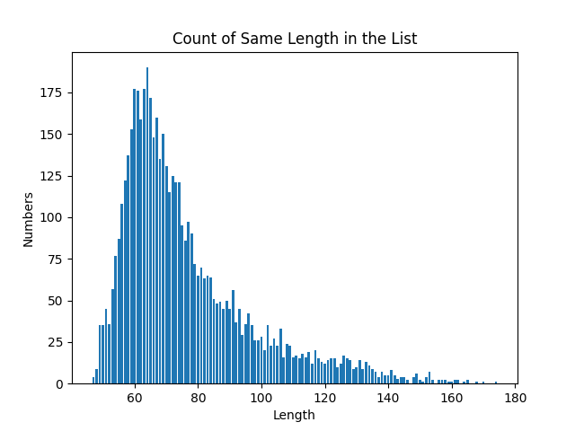
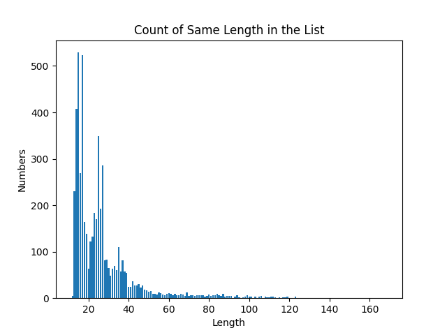
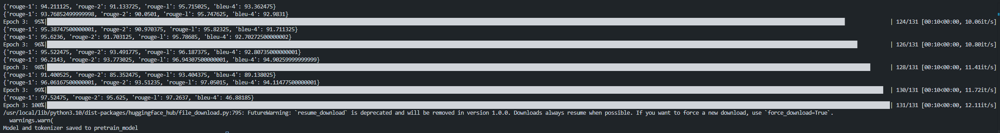
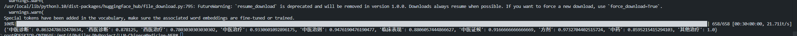

# LLM-ChineseMedicine-NER

基于大模型的中医药命名实体识别

## 数据

### 数据集

数据集使用中医药领域相关的数据集。数据位于 [data](./data/)目录下。

该数据集主要是中医药领域相关的数据集，可用于命名实体识别等自然语言处理任务；划分训练集、验证集和测试集共约 6000 条标注数据。

### 数据分析

针对数据（input/target 的 IDs）的长度进行统计，如下

Input：



大部分数据的长度集中在 120 以下。

Labels：



大部分数据的长度集中在 40 以下。

### 数据改造

我们采用个 23 指令微调模板如下，对原始数据进行改造，每一条数据会随机使用其中的一个模板。

```python
template = [
    "找出指定的实体：\\n[INPUT_TEXT]\\n类型选项：[LIST_LABELS]\\n答：",
    "找出指定的实体：\\n[INPUT_TEXT]\\n实体类型选项：[LIST_LABELS]\\n答：",
    "找出句子中的[LIST_LABELS]实体：\\n[INPUT_TEXT]\\n答：",
    "[INPUT_TEXT]\\n问题：句子中的[LIST_LABELS]实体是什么？\\n答：",
    "生成句子中的[LIST_LABELS]实体：\\n[INPUT_TEXT]\\n答：",
    "下面句子中的[LIST_LABELS]实体有哪些？\\n[INPUT_TEXT]\\n答：",
    "实体抽取：\\n[INPUT_TEXT]\\n选项：[LIST_LABELS]\\n答：",
    "医学实体识别：\\n[INPUT_TEXT]\\n实体选项：[LIST_LABELS]\\n答：",
    "在下面的文本中找出医疗命名实体：\n[INPUT_TEXT]\n请从以下类型中选择医疗命名实体：[LIST_LABELS]\n答：",
    "请从以下文本中提取医疗命名实体：\n[INPUT_TEXT]\n医疗命名实体的类型包括：[LIST_LABELS]\n答：",
    "识别以下文本中的医疗命名实体：\n[INPUT_TEXT]\n请标注以下类型的医疗命名实体：[LIST_LABELS]\n答：",
    "请从以下句子中找出[LIST_LABELS]实体：\n[INPUT_TEXT]\n答：",
    "[INPUT_TEXT]中包含了哪些[LIST_LABELS]实体？请列举出来。\n答：",
    "在给定的文本[INPUT_TEXT]中，请标出所有的[LIST_LABELS]实体。\n答：",
    "[INPUT_TEXT]\n问题：请标出句子中的[LIST_LABELS]实体。\n答：",
    "[INPUT_TEXT]\n问题：你能识别出句子中的哪些[LIST_LABELS]实体吗？\n答：",
    "[INPUT_TEXT]\n问题：根据句子内容，找出其中的[LIST_LABELS]实体。\n答：",
    "请识别以下医学文本中的实体：\\n[INPUT_TEXT]\\n实体类型：[LIST_LABELS]\\n答：",
    "在下述文本中标记出医学实体：\n[INPUT_TEXT]\n可识别的实体有：[LIST_LABELS]\n答：",
    "医学命名实体识别任务：\n请从下面的文本中提取医疗实体：\n[INPUT_TEXT]\n实体类型包括：[LIST_LABELS]\n答：",
    "请标出以下句子中的医疗实体类型为[LIST_LABELS]的实体：\n[INPUT_TEXT]\n答：",
    "请识别并列举出以下文本中属于[LIST_LABELS]类型的医疗实体：\\n[INPUT_TEXT]\\n答：",
    "在下面的句子中找出所有关于[LIST_LABELS]的医疗实体：\\n[INPUT_TEXT]\\n答：",
]
```

经过改造后，医疗数据集都将转化为如下格式。input 字段是模型的输入，target 字段是模型的输出，task_type 是原任务类型(不作为模型输入)，task_dataset 是任务数据集描述，sample_id 是样本的下标，answer_choices 字段是选项，target 是回答。

```json
{
  "input": str,
  "task_type": str,
  "task_dataset": str,
  "sample_id": str,
  "answer_choices": list,
  "target": str
}
```

示例：

```json
{
    "input": "找出指定的实体：\\n投活络效灵丹加味：当归、丹参各１５ｇ，生乳香、生没药各６ｇ，柴胡１２ｇ，白芍、黄芩、大黄各１０ｇ，蒲公英３０ｇ，甘草５ｇ\\n类型选项：中医治疗，中医诊断，西医诊断，中医治则，中药，方剂，临床表现，中医证候，西医治疗，其他治疗\\n答：",
    "task_type": "ner",
    "task_dataset": "custom_data",
    "sample_id": "fdev_0",
    "answer_choices": [
        "中医治疗",
        "中医诊断",
        "西医诊断",
        "中医治则",
        "中药",
        "方剂",
        "临床表现",
        "中医证候",
        "西医治疗",
        "其他治疗"
    ],
    "target": "上述句子中的实体包含：\n方剂实体：活络效灵丹\n中药实体：当归\n中药实体：丹参\n中药实体：生乳香\n中药实体：生没药\n中药实体：柴胡\n中药实体：黄芩\n中药实体：大黄\n中药实体：蒲公英\n中药实体：甘草"
},
```

## 微调

项目使用 Qwen 模型，进行 Lora 微调。

微调过程支持了两种不同的数组预处理方式：

1. 所有样本统一拼接后分块处理，每个样本的长度不超过 128 个 token。
2. 每个样本单独处理，对每个样本的输入和标签分别按照最大长度进行截断，不够最大长度的部分用 [PAD] 填充。

其中第一种训练方式的训练效率明显高于第二种，在 epoch = 2，batchsize = 4，的配置下，第一种方式的 loss 可以收敛到 0.2806，且训练速度在 7 it/s 左右。根据上述的数据分布情况，可以看到，如果采用padding的方式，会引入大量的无用计算，整体的计算效率会变低，且因为引入了截断，一些有效信息可能被丢弃，实验观察导致收敛速度会变慢。

第一种方式的验证集效果如下：



## 结果

```json
{
  "中医诊断": 0.8632478632478634,
  "西医诊断": 0.878125,
  "西医治疗": 0.7803030303030302,
  "中医治疗": 0.9330601092896175,
  "中医治则": 0.9476190476190477,
  "临床表现": 0.8806057444866627,
  "中医证候": 0.9166666666666669,
  "方剂": 0.9732704402515724,
  "中药": 0.8595215415294103,
  "其他治疗": 1.0
}
```



结果存储在 [ruslts.json](ruslts.json) 文件中，示例如下：

```json
{
  "query": "问：\n下面句子中的其他治疗，西医治疗，中药，西医诊断，中医治疗，中医诊断，中医证候，方剂，中医治则，临床表现实体有哪些？\\n药进１０帖，黄疸稍退，饮食稍增，精神稍振\\n",
  "answer": [
    {
      "中医诊断": ["黄疸"]
    }
  ],
  "pred": [
    {
      "中医诊断": ["黄疸"]
    }
  ]
}
```
